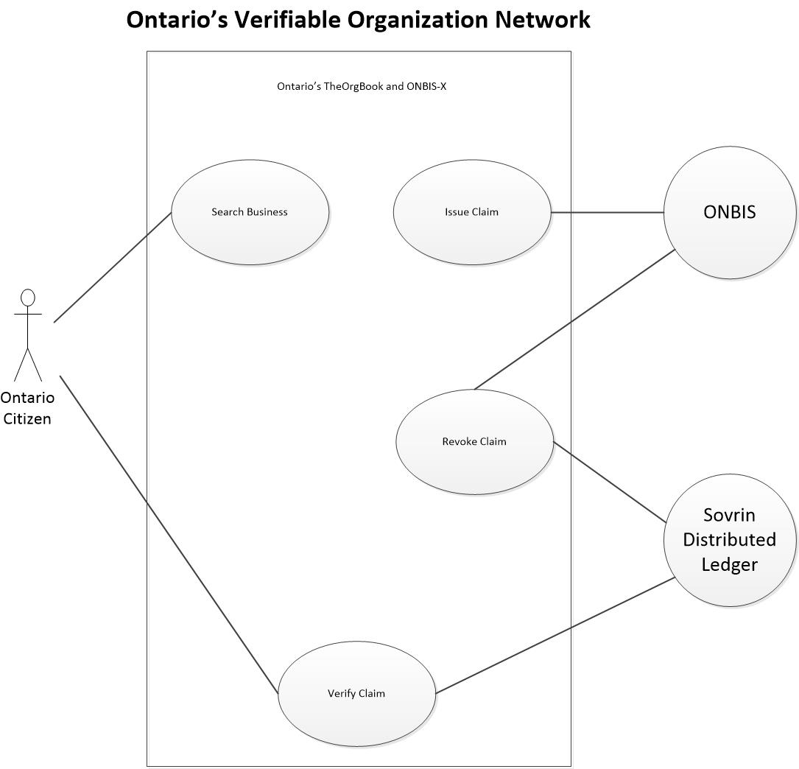
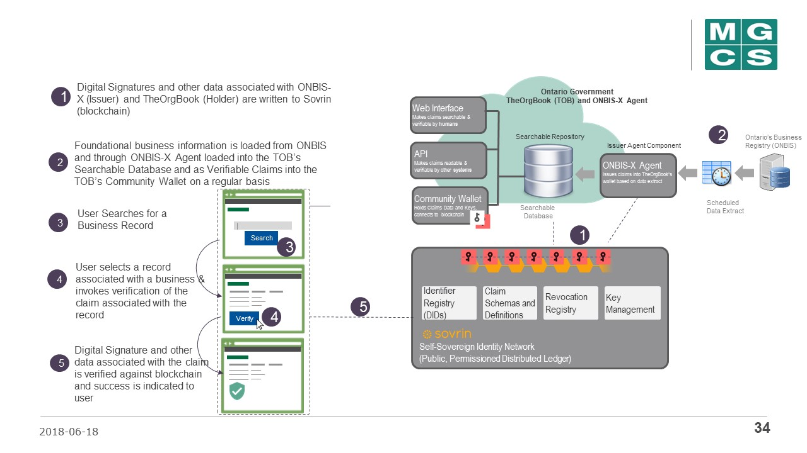

## Ontario's participaton in the Verifiable Organization Network (VON) project

Government of Ontario joined the VON Project in fall 2017 looking to explore the use of blockchain as an enabler for businesses to provide proofs of government-issued qualifications and credentials when transacting online. In addition to acquiring the knowledge of Hyperledger Indy blockchain technology, the pilot aimed to build a production-ready repository   - Ontario's TheOrgBook - of verifiable claims about a business, prepopulated with foundational information about all Ontario businesses based on the data from Ontario's official business registry, **ONBIS**. All data currently stored in Ontario's TheOrgBook is publicly available business information.

### Use Cases for Ontario's TheOrgBook

|Use Case   | Brief Description  |  Initiating Actor |
|---|---|---|
| Search Businesses  |  A Claim Requestor (a User) enters search criteria and is returned a list of business matches based on the criteria. | Claim Requestor  |
| Verify Claim   | The Claim Requestor selects the business and the claim and requests verification. TheOrgBook System sends the request to the Sovrin Blockchain Node which verifies the request and returns the verification information to TheOrgBook. TheOrgBook then presents the verified claim to the Claim Requestor  |  Claim Requestor |
| Revoke Claim  | At any point the Claim Issuer may revoke a previously issued claim and notifies TheOrgBook. TheOrgBook sends a request to the Sovrin Blockchain Node to update the ledger (Specifically the Revocation Registry) in order to revoke a specific claim.  |ONBIS   |
| Load New Claim Batch  |  At a predetermined time, ONBIS forwards new business information to a drop location (file share). TheOrgBook system retrieves the file and loads the new business information. TheOrgBook then sends a request to create the claim information (key pairs, revocation information, schema) on the ledger and receives a response back. | ONBIS  |

### High Level Flow Diagram :

### What's on the Ledger?

|Owner   |  Type  |  Name |  Description |
|---|---|---|---|
| ONBIS-X as Issuer  | DID+DIDoc |  |  DID Registration |
| Ontario's TheOrgBook as Issuer and Holder |  DID+DIDoc |  | DID Registration | 
| ONBIS-X   | Schema*  | registration.registries.ca |  Business Registration Information |
| ONBIS-X   | Schema*  | relationship.registries.ca | Business Relationships ** Information |
| ONBIS-X   | Schema*  | address.registries.ca | Business Address Information |
| ONBIS-X   | Schema Definition  | | Business Registration Information for ONBIS |
| ONBIS-X | Schema Definition  |  | Business Relationship Information for ONBIS |
| ONBIS-X  | Schema Definition  | | Business Address Information for ONBIS|

\* - **ONBIS-X Issuer and BC Registries Issuer share the same schemas for busines registrations, relationships and addresses credentials so only one schema is written to the ledger for each of the three credential types that these two systems will issue**

** - Business Relationships schema allows connecting a legal incorporation to (multiple) business names it is operating under (future enhancement,  not currently implemented for Ontario)

Personal data, or actual values for fields that make up a claim, are never written to the Hyperledger Indy. Rather, all private data is exchanged over peer-to-peer encrypted connections between off-ledger agents. The ledger is only used for anchoring rather than publishing encrypted data.

Actual values of the data elements written to the DEV instance of the BCovrin ledger - a local Sovrin instance run by Province of BC for testing and development purposes -  can be seen through  Blockchain Explorer interface for DEV BCovrin available at:

http://159.89.115.24/browse/domain   - **DEV BCovrin**

## Ontario's TheOrgBook Source Code Organization

Ontario and BC use the same code base for TheOrgBook application stored in a single repo - [bcgov's TheOrgBook GitHub repo](https://github.com/bcgov/TheOrgBook).

The customizations that include the province specific UI look-n-feel and business rules for displaying data are applied dynamically at deployment through setting the TOB_THEME environmental variable in OpenShift. Sharing the same repo approach provides both teams with immediate access to all updates and enhancements in TheOrgBook's code as provided by each of them.

### Ontario's TheOrgBook Architecture 

There are two core components developed within the Ontario's VON Project:

**TheOrgBook** which implements a microservices architecture approach and consists of multiple sub-components, each having a specific function and running as a separate Docker container. 

* API - **tob-api** directory in TheOrgBook's repo - the API components implements RESTful endpoints for system-to-system communication - within TheOrgBook and with external applications. Only read-only endpoints are open for public use. The write endpoints require authentication. Implemented using Django 1.11 and Python 3.

* Web UI - **tob-web** directory in TheOrgBook's repo - built using Angular and uses templates to allow customizations to be applied to UI. The choice of templates and design elements is driven by the value of TOB_THEME environmental variable. Read more about our approach to theme development [here](https://github.com/bcgov/TheOrgBook/blob/master/tob-web/ThemeDevelopment.md) and accessibility compliance [here](https://github.com/bcgov/TheOrgBook/blob/master/tob-web/ACCESSIBILITY.md). 

* Database - **tob-db** directory in TheOrgBook's repo - this is a searchable database implemented using PostgreSQL 10 and contains  business information that is searchable via the web UI.

* Search Engine configiration - **tob-solr** directory in TheOrgBook's repo - TheOrgBook uses Solr search engine to deliver real time indexing for records in the database and the autocomplete capability. This sub-component contains a custom configuration for Solr.

* Enterprise Wallet -  **tob-wallet** directory in TheOrgBook's repo - a configuration for Hyperledger Indy Enterprise wallet. The wallet component itself is included as a part of the von-image Docker image file.

### Ontario's TheOrgBook Source Code Dependency Diagram 

### Ontario's TheOrgBook Network Architecture Diagram 

TheOrgBook's components (Web UI, API, Database, Search Engine configuration) and ONBIS-X components (VON-X config, Wallet, DidAuth) are deployed in Government of BC's PathFinder OpenShift platform and hosted in the Kamloops data center. ONBIS application that plays the role of the Verifiable Claims Issuer is hoted within Ontario's domain.  

