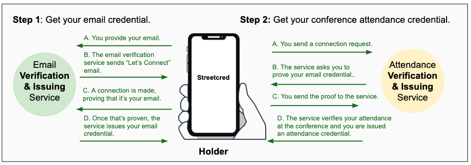
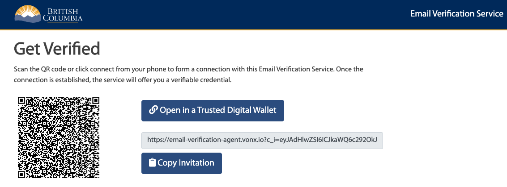
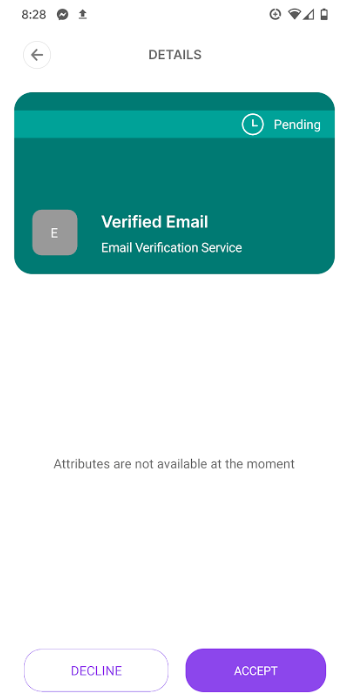
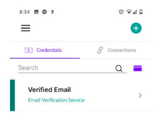
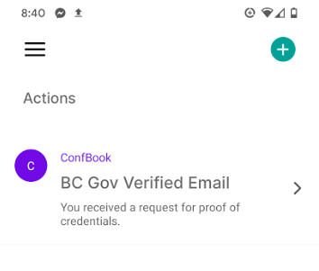
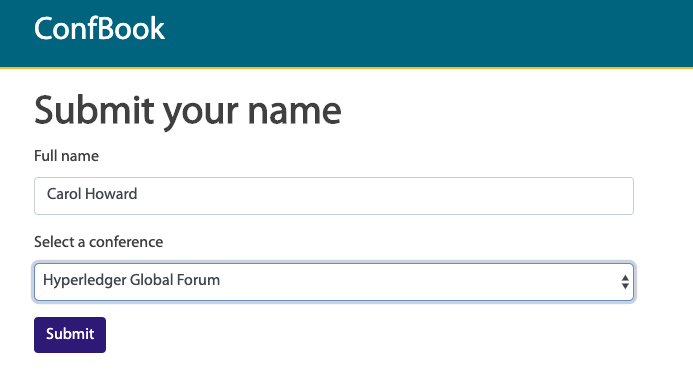
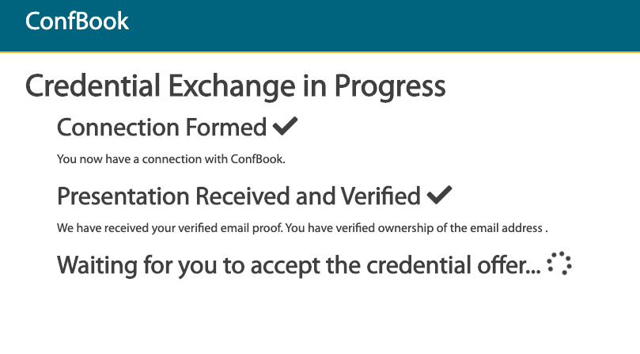
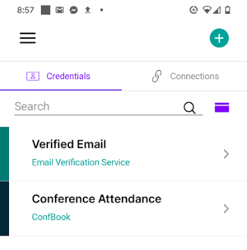

## Introduction

In March 2019, the [VON team](https://vonx.io/) created [AgentBook](https://vonx.io/news/2019-03-28-Global-Connection) to demonstrate the interoperability of independently created agents. These agents were able to successfully establish DID-based communication channels. ConfBook Attendance Issuer (ConfBook), extends the core of AgentBook with the ability to exchange verifiable credentials. Even cooler, through collaboration with [Trinsic.id](https://trinsic.id/) (formerly Streetcred.id) and [Mattr Global](https://mattr.global) New Zealand, we have a [mobile agent](https://vonx.io/news/2019-04-03-Mobile-Agent).

In this demo, you’ll see how ConfBook is used to issue a verifiable credential asserting a requester is a conference attendee based on their verified email address. The following is a guide to get started with the ConfBook demo. Grab your phone and let’s get started!

## Demonstration Overview

The goal of this demo is to show how Hyperledger Aries-based compatible agents can be used to:

*   set up agent-to-agent communication
*   verify and issue credentials
*   send proofs

[Credentials](https://w3c.github.io/vc-data-model/#credentials) contain claims that refer to a qualification, achievement, personal quality, or aspect of an entity that can be used to establish trust online in countless contexts&mdash;including identity. Using a mobile wallet you can use the ConfBook demo to collect credentials (in particular, your email and conference attendance record). Instructions to get a compatible wallet can be found [here](/getwallet).

This demo steps you through the process of obtaining two credentials—that’s pretty cool in itself. However, keep in mind that by obtaining verifiable credentials and establishing connections with your peers at the conference, you are demonstrating the power of self-sovereign identity. Your credentials prove things about you so others know for certain they are talking to you! Conversely, when you connect to others and they prove who they are, you can be certain they are who they say they are. That is powerful.

The following illustration shows the process involved in obtaining verifiable credentials from the two services (Email Verification & Issuing Service and ConfBook Attendance Verification & Issuing Service) built for this demo. The two services are typical enterprise-style applications but in addition, they each have their own agent and a public [DID](https://w3c-ccg.github.io/did-spec/), which enables them to issue verifiable credentials.

## TL;DR

1. On your mobile device, install a wallet following the instructions [here](/getwallet).
2. Initialize the wallet and make sure it is configured to use the "Sovrin Staging" network from the app “Settings” screen.
3. Get an email address verifiable credential: [https://email-verification.vonx.io](https://email-verification.vonx.io/)
4. Get a conference (e.g. Hyperledger Global Forum) attendee verifiable credential: [https://confbook.vonx.io](https://confbook.vonx.io/)

## Installing a wallet and Creating Your Agent

To get started, you’ll need a compatible agent using the instructions [here](/getwallet). The pictures here are from an older version of the Trinsic wallet, when it was called "Streetcred."

1. For this demo, the wallet app must use the Sovrin Foundation's Sovrin Staging Hyperledger Indy network instance. To set the network, to go to the app's Home tab and tap the settings icon to go to the app’s settings screen. On the settings screen, edit the Network Selection setting and select Sovrin Staging.”

## Getting Your Email Credential

With your mobile wallet up and running, the next thing you’ll do is get your email verifiable credential.

To do this:

1. In a browser, go to the following URL, read the instructions, input your email address and click **Submit**. \
[https://email-verification.vonx.io \
](https://email-verification.vonx.io/)

[ \
](https://email-verification.vonx.io/)You will receive an email from `noreply@gov.bc.ca` with an embedded one-time use link back to the Email Verification Service.

1. Click on the link provided in the email. This does two things:

    *   Opens up a page on the Email Verification site with an invitation (in various forms) to connect to the Email Verification Service’s agent.
    *   Proves to the Email Verification Service that the current user controls the email address to which the message was sent.

    **_NOTE: The latter point is important—this is the basis for the verifiable credential that the service will issue to the agent that connects to it via the invitation._

The following window is displayed:

1. Use one of the invitations:

    *   If the invitation is on your mobile device, click the link to open the Streetcred app.
    *   If the invitation is on a desktop device, use your Streetcred app to scan the QR code.
    *   If you are using some other agent, copy the invitation and paste as appropriate into that agent.

2. In the Streetcred app the following window is displayed:

1. Click **Accept** to complete the connection. \
You will receive a notification—the Email Verification Service has sent you an offer for a verifiable credential, and the website will update to show your progress.
6. Click the **Credentials** icon to see your email credential. It might take a few moments to arrive.

w00t!! You have your first verifiable credential and you can prove ownership of your email address whenever it’s needed.

## Getting Your Conference Attendance Credential

You have been issued one credential&mdash;let’s use it to get another. This credential is only for attendees of the conference (e.g. Hyperledger Global Forum), so you’ll have to provide a verified email address that will be checked against the attendee list. Meet both of these requirements and you’ll get your conference attendee credential.

1. In a browser, go to ConfBook: [https://confbook.vonx.io](https://confbook.vonx.io/).
2. Click **Connect to ConfBook** and connect to ConfBook as you did with the email verification service.
3. Once you have connected, you will be asked for proof of your email verification credential. In Streetcred, that will look like this:

1. On the ConfBook website, you will be asked for your name and to select the conference you attended. If you are doing this all on a mobile phone, switch back to the website in your browser.

5. Once you submit that data and you will again go through the flow of being issued a credential, just like when you got your verified email credential.

6. In the mobile wallet app, you will be notified of an offer for a conference attendee verifiable credential—just like when you received your verified email credential.

There you go! You have been issued a credential, had it verified and based on that verification, been offered another credential. You should now have two credentials in your wallet:

## References

ConfBook was coordinated by the [VON team](https://vonx.io/) of the Government of British Columbia. The following GitHub repositories were created/used as the basis of the ConfBook demo:

*   The mobile wallet apps are based on the open source [aries-framework-dotnet](https://github.com/hyperledger/aries-framework-dotnet) project.
*   The email verification service and ConfBook are instances of the open source [aries-cloud-agent-python (ACA-Py)](https://github.com/hyperledger/aries-cloudagent-python) project.
*   The repos for the services are:
    *   [Email Verification Service](https://github.com/bcgov/indy-email-verification)
    *   [ConfBook](https://github.com/bcgov/iiwbook)
*   The protocols used in the demo are part of Aries Interop Profile 1.0, as defined in the Aries RFC repository.
    *   [Aries Interop Profile 1.0](https://github.com/hyperledger/aries-rfcs/tree/master/concepts/0302-aries-interop-profile)
